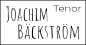

# Tenor Joachim Bäckström Backend

This is the backend for a website presenting Tenor Joachim Bäckström's resume and future.

## Tech Stack project

**Client:** React, SCSS

**Server:** Nodejs, Express

**Database:** MongoDB Atlas

## Tech Stack backend

**Server:** Nodejs
**Npm-packages:**

- cors
- crypto-js
- dotenv
- express
- mongodb
- morgan
- nanoid
- nodemon

## Start project

npm install
nodemon start

## Local server: http://localhost:3001/

## Deployed:

- Frontend: https://project-frontend-degree.vercel.app/
- Backend: https://degree-project-backe-end.onrender.com
